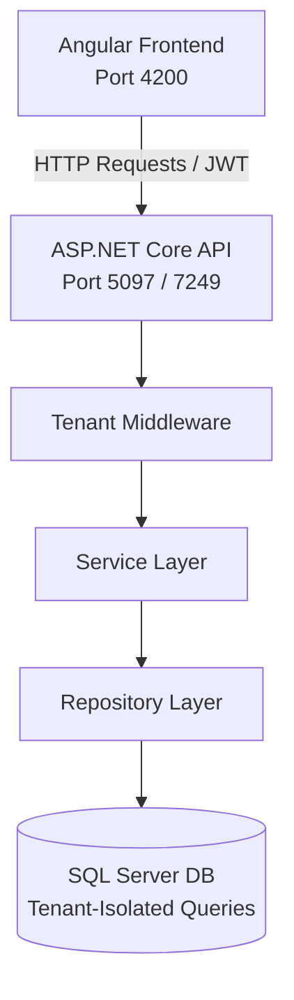

# Multi-Tenant Inventory SaaS Platform

This repository contains both the **Frontend** and **Backend** codebases for the Multi-Tenant Inventory SaaS Platform. The system is designed to handle multiple tenants (businesses) with isolated data, setting customizations, warehouse tracking, product catalogs, role-based user access control, and stock movements.

---

## 🏗️ Project Architecture Overview



- **Frontend:** Single Page Application (SPA) built using Angular.
- **Backend:** N-Tier Architecture (API, Service, Repository layers) built using ASP.NET Core and Entity Framework Core with SQL Server.
- **Multi-Tenancy:** Handled dynamically via middleware and custom header/domain resolution, ensuring database query isolation per tenant.

---

## 📁 Repository Structure

- **[`/Frontend`](file:///d:/Depi%20Project/Frontend)**: The Angular client application.
- **[`/Backend`](file:///d:/Depi%20Project/Backend)**: The .NET Core backend solution containing:
  - `InventoryManagement.API`: Controllers, JWT auth, and middleware.
  - `InventoryManagement.Service`: Business logic, services, and DTOs.
  - `InventoryManagement.Repository`: DbContext, EF migrations, entities, and repository patterns.

---

## 🛠️ Backend Setup (.NET / SQL Server)

The backend is built with **ASP.NET Core 8+** and **Entity Framework Core**.

### Prerequisites
- [.NET SDK 8.0+](https://dotnet.microsoft.com/download)
- [SQL Server](https://www.microsoft.com/sql-server/) (or LocalDB)
- Optional: [Visual Studio 2022](https://visualstudio.microsoft.com/) or JetBrains Rider

### Getting Started

1. **Navigate to the Backend directory:**
   ```bash
   cd Backend
   ```

2. **Configure Database Connection String:**
   Open `InventoryManagement.API/appsettings.json` (or `appsettings.Development.json`) and configure your SQL Server connection:
   ```json
   "ConnectionStrings": {
     "DefaultConnection": "Server=(localdb)\\mssqllocaldb;Database=InventoryManagementDb;Trusted_Connection=True;MultipleActiveResultSets=true;TrustServerCertificate=True"
   }
   ```

3. **Apply EF Core Migrations:**
   Ensure you have the EF Core tools installed (`dotnet tool install --global dotnet-ef`). Then run:
   ```bash
   dotnet ef database update --project InventoryManagement.Repository --startup-project InventoryManagement.API
   ```

4. **Run the Backend API:**
   ```bash
   dotnet run --project InventoryManagement.API
   ```
   By default, the API will launch at:
   - HTTP: `http://localhost:5097`
   - HTTPS: `https://localhost:7249`
   - Swagger Documentation: `http://localhost:5097/swagger` (or `/swagger/index.html` depending on your profile)

---

## 🎨 Frontend Setup (Angular)

The frontend is built with **Angular CLI** and communicates with the backend API.

### Prerequisites
- [Node.js](https://nodejs.org/) (LTS recommended)
- Angular CLI (`npm install -g @angular/cli`)

### Getting Started

1. **Navigate to the Frontend directory:**
   ```bash
   cd Frontend
   ```

2. **Install Dependencies:**
   ```bash
   npm install
   ```

3. **Run the Development Server:**
   ```bash
   ng serve
   ```
   Open your browser and navigate to `http://localhost:4200/`. The application will automatically reload if you change any source files.

4. **Production Build:**
   ```bash
   ng build --configuration production
   ```
   The compiled assets will be stored in the `dist/` directory.

---

## 🐳 Docker Compose Quick Start (Easiest Method)

To run the entire application (SQL Server, Backend API, and Frontend Angular client) instantly without manual database setup or local .NET/Node installations:

### Prerequisites
- [Docker Desktop](https://www.docker.com/products/docker-desktop/) installed and running.

### Steps to Run

1. **Clone/open this repository directory in your terminal.**
2. **Start the containers:**
   ```bash
   docker compose up --build -d
   ```
3. **Verify running containers:**
   - **Frontend App:** Navigate to `http://localhost:4200`
   - **Backend Swagger:** Navigate to `http://localhost:5097/swagger`
   - **SQL Server DB:** Runs inside the docker network and is exposed to the host on port `1433`.

### Useful Commands
- **Stop application:**
  ```bash
  docker compose down
  ```
- **Stop application and delete database volumes (Fresh Start):**
  ```bash
  docker compose down -v
  ```
- **View Backend logs:**
  ```bash
  docker compose logs backend
  ```

---

## 🔑 Key Features & Technologies

### Backend Features
- **Multi-Tenancy:** Resolved dynamically per request (e.g., using subdomains, headers, or query parameters).
- **Security:** ASP.NET Core Identity & JWT (JSON Web Token) authentication with role-based authorization.
- **Clean Architecture:** Proper separation of concerns using N-Tier layers.
- **RESTful Endpoints:** Complete API for Products, Categories, Stock Movements, Warehouses, Roles, and Tenant settings.

### Frontend Features
- **Modular Components:** Modular structure separating pages, core utilities, and shared layout components.
- **Route Guards:** Protect pages from unauthorized access based on authentication token and roles.
- **State Management & Services:** Responsive services to integrate with APIs.
